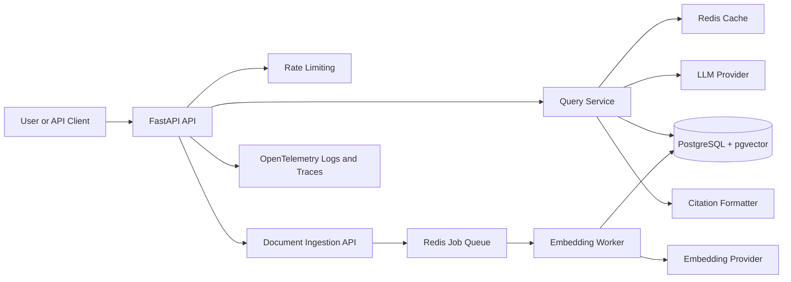

# AI KnowledgeOps Platform

AI KnowledgeOps Platform is a production-style retrieval-augmented generation system for ingesting internal documents, indexing searchable chunks, and answering questions with citations.

The project is intentionally designed like an engineering portfolio piece: clear architecture, local infrastructure, tests, observability hooks, and room for realistic scaling work.

## Problem Statement

Engineering and operations teams often store critical knowledge across PDFs, Markdown files, runbooks, tickets, and internal docs. Search alone does not answer operational questions well, while naive LLM chat over documents tends to lack traceability. This platform demonstrates how to build a reliable RAG service with ingestion, retrieval, citations, evaluation, and production-minded boundaries.

## Architecture



## Features

- FastAPI backend skeleton with health checks
- Environment-based configuration with safe local defaults
- Document chunking service with unit tests
- Document ingestion persistence with idempotent content hashing
- SQLAlchemy models and Alembic migrations for documents, chunks, and embedding jobs
- Deterministic local embedding provider for offline development and tests
- CLI embedding job processor with leases, retry, failure, and idempotent rerun behavior
- Deterministic embedding retrieval with metadata filtering and citations
- Docker Compose for PostgreSQL/pgvector and Redis
- GitHub Actions CI for linting and tests
- System design documentation with scaling, reliability, and security notes

## Tech Stack

- Python 3.12
- FastAPI
- Pydantic Settings
- SQLAlchemy
- Alembic
- PostgreSQL with pgvector
- Redis
- pytest
- Ruff
- Docker Compose
- GitHub Actions

## Local Setup

Create an environment file:

```bash
cp .env.example .env
```

Install dependencies:

```bash
python3 -m venv .venv
source .venv/bin/activate
pip install -e ".[dev]"
```

Start local infrastructure once Docker is installed:

```bash
docker compose up -d
```

Run the API:

```bash
uvicorn app.main:app --reload
```

Health check:

```bash
curl http://localhost:8000/health
```

## Environment Variables

| Variable | Purpose | Example |
| --- | --- | --- |
| `APP_ENV` | Runtime environment label | `local` |
| `LOG_LEVEL` | Logging verbosity | `INFO` |
| `DATABASE_URL` | PostgreSQL connection string | `postgresql+psycopg://...` |
| `REDIS_URL` | Redis connection string | `redis://localhost:6379/0` |
| `LLM_PROVIDER` | LLM provider selector | `mock` |
| `EMBEDDING_PROVIDER` | Embedding provider selector | `mock` |
| `RATE_LIMIT_PER_MINUTE` | API rate limit target | `60` |

## API Examples

```bash
curl http://localhost:8000/health
```

```bash
curl -X POST http://localhost:8000/query \
  -H "Content-Type: application/json" \
  -d '{"question":"What does this platform do?","metadata_filter":{"team":"ai-platform"},"limit":5}'
```

```bash
curl -X POST http://localhost:8000/documents \
  -H "Content-Type: application/json" \
  -d '{
    "source": "sample/platform-overview.md",
    "title": "Platform Overview",
    "text": "AI KnowledgeOps indexes internal documents for retrieval.",
    "metadata": {"team": "ai-platform"}
  }'
```

## Database Migrations

Run migrations after PostgreSQL is available:

```bash
alembic upgrade head
```

The test suite uses SQLite to validate ingestion behavior without Docker. PostgreSQL/pgvector integration tests will be added once a Docker-capable or external Postgres environment is available.

## Embedding Jobs

Document ingestion creates pending embedding jobs for each persisted chunk. The local default embedding provider is deterministic and does not call paid APIs, which keeps development and CI repeatable.

Process a bounded batch of pending jobs:

```bash
python -m app.jobs.process_embeddings --limit 10 --worker-id local-worker
```

The worker claims pending jobs by marking them `in_progress` with `locked_at` and `locked_by`, stores vectors on `document_chunks.embedding`, marks successful jobs `completed`, records provider errors on failed attempts, and marks jobs `failed` once `--max-attempts` is reached. Fresh in-progress jobs are left alone, stale leases are recovered after `--lease-timeout-seconds`, completed jobs are skipped on reruns, and failed jobs can be reset by worker code for an explicit retry path.

## Query Retrieval

`POST /query` embeds the question with the configured embedding provider, scores stored chunk embeddings with cosine similarity, applies optional exact-match metadata filters, and returns the highest-scoring citations. The current response is intentionally retrieval-only: LLM answer synthesis is not connected yet, so the answer text directs callers to the returned citation evidence instead of inventing unsupported prose.

The retriever runs in Python over JSON-stored vectors so SQLite tests and offline development remain deterministic. PostgreSQL/pgvector nearest-neighbor indexes are the planned production path once local Docker-based integration tests are available.

## Testing

```bash
pytest
ruff check .
```

## Scaling Considerations

- Split ingestion workers from API replicas.
- Use Redis-backed queues with retries and dead-letter handling.
- Partition document chunks by tenant or corpus for larger deployments.
- Add approximate nearest-neighbor indexes through pgvector once data volume warrants it.
- Cache high-frequency retrieval results with invalidation tied to document versions.

## Reliability Considerations

- Ingestion should be idempotent by document checksum and source ID.
- Embedding jobs use worker leases to avoid duplicate processing and recover stale in-progress claims.
- Failed embedding jobs track attempts and terminal failure state; future queue backends should add exponential backoff.
- Query responses include citation metadata and chunk text for auditability.
- Provider failures should degrade to clear errors rather than uncited answers.

## Security Considerations

- No secrets are committed; use `.env` locally and managed secrets in CI or hosting.
- Uploaded documents should be scanned and size-limited before processing.
- Future auth should enforce corpus-level access control before retrieval.
- Logs should avoid storing full prompts or sensitive document content by default.

## Future Improvements

- Database migrations with Alembic
- Real embedding provider adapter behind the existing provider interface
- Redis-backed worker queue, exponential backoff, and dead-letter handling
- LLM answer synthesis over retrieved citations
- RAG evaluation runner and sample benchmark set
- Frontend document browser and query UI
- OpenTelemetry exporter configuration
- Integration tests against PostgreSQL and Redis
