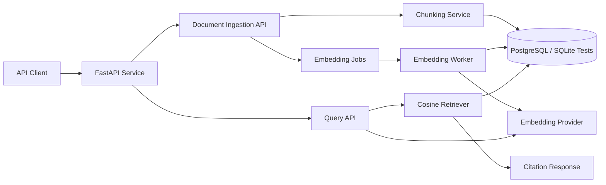

# AI KnowledgeOps Platform

Production-style retrieval platform for internal knowledge bases. It ingests documents, chunks and indexes content, processes embedding jobs with worker leases, and answers retrieval queries with grounded citations.

This project is built as an engineering portfolio piece for AI platform, developer productivity, and enterprise application roles. It emphasizes clear service boundaries, deterministic local development, CI-friendly tests, and production-minded tradeoffs rather than a thin LLM wrapper.

## Why This Exists

Engineering and operations teams often spread critical knowledge across runbooks, PDFs, Markdown files, tickets, SharePoint pages, and internal tools. Plain search returns documents, while naive chat over documents can produce unsupported answers. This platform demonstrates the core backend patterns behind a reliable RAG system:

- idempotent document ingestion
- durable chunk and metadata storage
- background embedding jobs
- retryable worker processing
- metadata-filtered retrieval
- citation-first responses
- testable provider abstractions

## Architecture



The local/test path uses deterministic embeddings and SQLite-compatible JSON vectors so the full ingestion and retrieval workflow can run without paid APIs. PostgreSQL with pgvector is the intended production storage path and is included in Docker Compose.

## What Reviewers Should Notice

- FastAPI app with explicit request/response contracts.
- SQLAlchemy domain models for documents, chunks, and embedding jobs.
- Alembic migrations for schema evolution.
- Idempotent ingestion based on source and content hash.
- Chunk-level embedding jobs with status, attempts, errors, lock owner, and lock timestamp.
- Worker lease recovery for stale `in_progress` jobs.
- Deterministic embedding provider for reliable local tests and CI.
- Metadata-filtered retrieval with citation objects instead of unsupported generated prose.
- Focused pytest coverage for ingestion, chunking, worker behavior, retrieval, and API contracts.
- GitHub Actions workflow for automated quality checks.

## Features

- `POST /documents` ingests text, persists chunks, and creates embedding jobs.
- `python -m app.jobs.process_embeddings` processes a bounded batch of pending jobs.
- `POST /query` embeds a question, applies optional exact-match metadata filters, scores chunks, and returns citations.
- `GET /health` exposes basic service health and environment information.
- Docker Compose provides PostgreSQL/pgvector and Redis for local infrastructure.
- Structured project documentation captures scaling, reliability, security, and tradeoffs.

## Tech Stack

- Python 3.12
- FastAPI
- Pydantic Settings
- SQLAlchemy
- Alembic
- PostgreSQL with pgvector
- SQLite for deterministic tests
- pytest
- Ruff
- Docker Compose
- GitHub Actions

## Repository Tour

```text
app/api/             FastAPI routers for health, document ingestion, and querying
app/db/              SQLAlchemy models, sessions, and persistence setup
app/ingestion/       Chunking and idempotent document ingestion services
app/embeddings/      Provider interface and deterministic local embedding provider
app/jobs/            Embedding job processor and CLI entrypoint
app/retrieval/       Retrieval models and cosine scoring service
alembic/             Database migrations
docs/                System design and production tradeoffs
sample_docs/         Small sample corpus for local experimentation
tests/               Unit and API tests
```

## Local Setup

Create an environment file:

```bash
cp .env.example .env
```

Install dependencies:

```bash
python3 -m venv .venv
source .venv/bin/activate
pip install -e ".[dev]"
```

Start local infrastructure once Docker is available:

```bash
docker compose up -d
```

Run migrations:

```bash
alembic upgrade head
```

Start the API:

```bash
uvicorn app.main:app --reload
```

Health check:

```bash
curl http://localhost:8000/health
```

## Demo Flow

Ingest a document:

```bash
curl -X POST http://localhost:8000/documents \
  -H "Content-Type: application/json" \
  -d '{
    "source": "sample/platform-overview.md",
    "title": "Platform Overview",
    "text": "AI KnowledgeOps indexes internal documents for retrieval and citation-backed answers.",
    "metadata": {"team": "ai-platform", "kind": "overview"}
  }'
```

Process embedding jobs:

```bash
python -m app.jobs.process_embeddings --limit 10 --worker-id local-worker
```

Query with a metadata filter:

```bash
curl -X POST http://localhost:8000/query \
  -H "Content-Type: application/json" \
  -d '{
    "question": "What does the platform do?",
    "metadata_filter": {"team": "ai-platform"},
    "limit": 5
  }'
```

The current query response is intentionally retrieval-only. It returns grounded citations and a clear message instead of synthesizing an LLM answer before a citation-constrained generation layer is implemented.

## Environment Variables

| Variable | Purpose | Example |
| --- | --- | --- |
| `APP_ENV` | Runtime environment label | `local` |
| `LOG_LEVEL` | Logging verbosity | `INFO` |
| `DATABASE_URL` | SQLAlchemy database URL | `postgresql+psycopg://...` |
| `REDIS_URL` | Redis connection string for future queue/cache work | `redis://localhost:6379/0` |
| `LLM_PROVIDER` | Reserved LLM provider selector | `mock` |
| `EMBEDDING_PROVIDER` | Embedding provider selector | `mock` |
| `RATE_LIMIT_PER_MINUTE` | API rate limit target | `60` |

## Testing

```bash
pytest
ruff check .
```

The test suite uses deterministic local providers and SQLite-backed persistence where possible, so core behavior can be validated without Docker or paid model APIs.

## Design Notes

More detail is available in [docs/system-design.md](docs/system-design.md).

Key tradeoffs:

- The deterministic embedding provider makes tests reliable, but production use needs a real embedding adapter.
- JSON-stored vectors and Python cosine scoring keep local tests simple; PostgreSQL/pgvector indexes are the intended path for larger corpora.
- Database-backed worker leases are easy to reason about in a portfolio project; a production queue would likely move retries, backoff, and dead-letter handling into Redis, Azure Service Bus, SQS, or a managed workflow system.
- Retrieval currently returns citation evidence only. LLM synthesis should be added behind strict citation and fallback rules.

## Future Improvements

- Add a real embedding provider adapter behind the existing provider interface.
- Add citation-constrained LLM answer synthesis.
- Add a small RAG evaluation runner and benchmark fixture set.
- Add integration tests against PostgreSQL/pgvector and Redis service containers.
- Add a lightweight web UI for document browsing and query inspection.
- Add OpenTelemetry exporter configuration for hosted environments.
