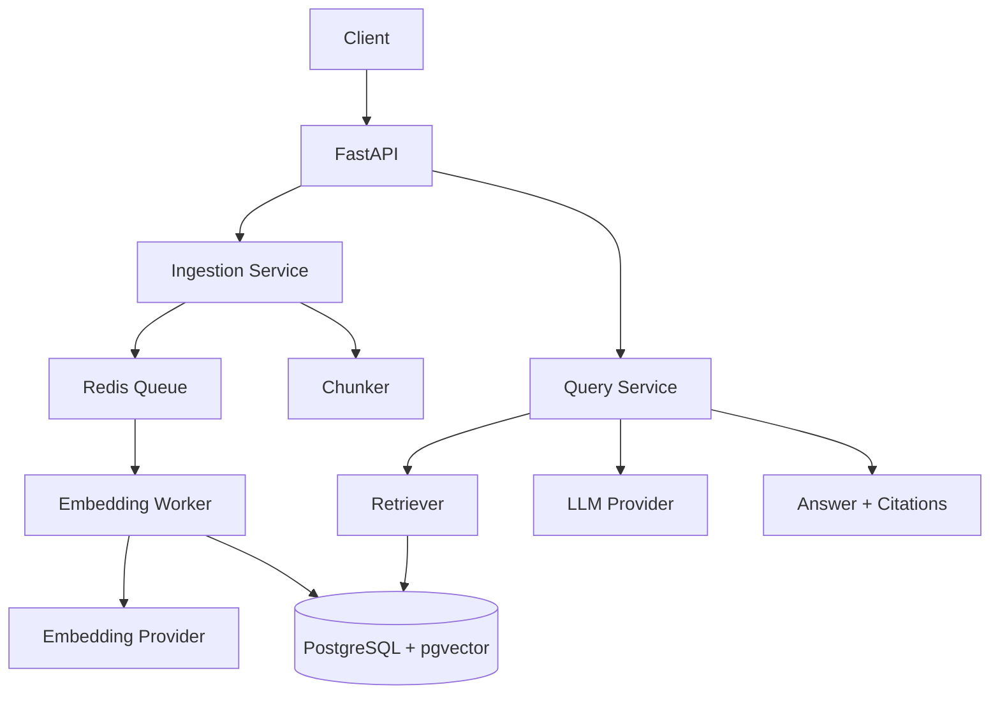

# System Design

## 1. Requirements

- Ingest documents from local files or API uploads.
- Split documents into searchable chunks.
- Generate embeddings for each chunk.
- Store chunks, metadata, and embeddings in PostgreSQL with pgvector.
- Retrieve relevant chunks for a user question.
- Generate an answer with citations back to source chunks.
- Provide local development through Docker Compose.

## 2. Non-Functional Requirements

- Local-first developer setup.
- Clear module boundaries for provider swaps.
- Testable services without paid API dependencies.
- Observable request, ingestion, and retrieval flows.
- Idempotent ingestion to avoid duplicate document chunks.

## 3. High-Level Architecture

## 4. Data Model

Initial entities:

- `documents`: source ID, title, content hash, metadata, timestamps.
- `document_chunks`: document ID, chunk index, text, token estimate, metadata, embedding.
- `query_events`: question, retrieval parameters, latency, selected chunk IDs, timestamps.

## 5. API Design

Initial endpoints:

- `GET /health`: service health and environment.
- `POST /documents`: ingest document text, persist chunks, and enqueue embedding jobs.
- `POST /query`: accepts a question and optional metadata filter, returns answer and citations.

Planned endpoints:

- `GET /documents/{id}`: inspect ingestion state.
- `POST /evaluations/run`: execute an evaluation set.

## 6. Scaling Strategy

- Horizontally scale stateless API containers.
- Scale workers independently based on queue depth.
- Use pgvector indexes for retrieval once chunk volume grows.
- Add Redis caching for repeated questions and stable corpora.
- Use object storage for large original documents.

## 7. Availability Strategy

- Keep API stateless.
- Treat Redis and PostgreSQL as managed stateful dependencies in production.
- Use health checks for API, database, and worker readiness.
- Add retry and dead-letter queues for ingestion failures.

## 8. Failure Handling

- Validate documents before queueing.
- Retry transient provider failures.
- Store failed job state with error details.
- Return explicit errors when citations cannot be produced.
- Avoid generating unsupported answers when retrieval confidence is low.
- Make ingestion idempotent with `(source, content_hash)` uniqueness.

## 9. Observability

- Structured JSON logs.
- Request IDs propagated through API and worker flows.
- Metrics for ingestion latency, queue depth, retrieval latency, and provider latency.
- Tracing hooks for API, database, Redis, and provider calls.

## 10. Security

- Secrets stay outside source control.
- Environment variables are documented in `.env.example`.
- Future authentication should enforce document-level authorization before retrieval.
- Logs should redact prompts and document text unless explicitly enabled for local debugging.

## 11. Tradeoffs

- PostgreSQL with pgvector keeps the local system simple and portfolio-friendly, but a dedicated vector database may be useful at very high scale.
- Mock providers make testing reliable without paid APIs, but production value requires real provider adapters.
- Docker Compose is enough for local development, while production should use managed database, cache, and secret services.

## 12. Future Improvements

- Alembic migrations.
- Real embeddings and model adapters.
- RAG quality evaluation script.
- Document upload workflow.
- Web UI.
- CI integration tests with service containers.
